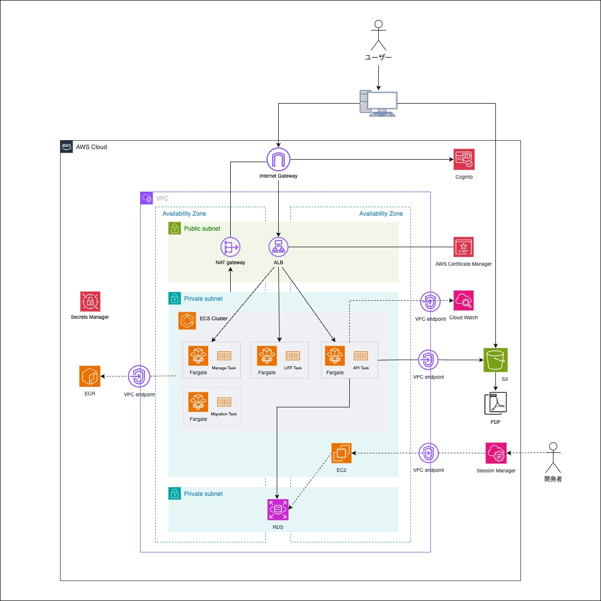

# 概要

- ECSとFargateを中心としたAWSスタックのCDKテンプレート
- API,管理画面,LIFFの常駐３タスクと+マイグレーションタスクがある想定
- ECRイメージのPUSHなどは別途やる想定

### アーキテクト図


## 事前準備

### AWS CLI

cdkを扱うにはaws cliが必要です。

自分の環境にない場合、適宜インストールしてください。

```bash
# インストール
brew install awscli
# 設定
aws configure --profile sample
export AWS_PROFILE=sample
```

AWSのアクセスキー、シークレットキー、デフォルトリージョン、および出力形式を設定します。
事前にマネジメントコンソールで十分な権限のユーザーでアクセスキーを発行してください。

### CDKツール

cdkツールもグローバルに入れておくこと。

```bash
yarn global add aws-cdk
```

# 手動デプロイ手順

apps/cdk/.envにAWSのアカウントIDとリージョンを設定

- 以下は今は不要
    - RDS_SECRET_MANAGER_ARN
    - API_AWS_SECRET_MANAGER_ARN
    - LINE_SECRET_MANAGER_ARN

```bash
CDK_DEFAULT_ACCOUNT=
CDK_DEFAULT_REGION=ap-northeast-1a
RDS_SECRET_MANAGER_ARN=
API_AWS_SECRET_MANAGER_ARN=
LINE_SECRET_MANAGER_ARN=
```

### 依存関係

bin/cdk.tsの順番通り、

NetworkStack→DnsStack→EcrStack→S3Stack→CognitoStack→IamStack→SsmEc2Stack→RdsStack→AppStackの順に作成していく。

(おそらく、NetworkStackを最初、AppStackを最後以外はそこまで依存関係ないかも

### 初期化

```bash
cdk bootstrap
```

cdk.tsのAppStackにて、.envにシークレットマネージャのARNがないと、現時点ではそもそも実行でないため、一旦コメントアウトしておく。

```bash
// new AppStack(app, "AppStack", {
//   env,
//   resourceName,
//   vpc: networkStack.vpc,
//   albSecurityGroup: networkStack.albSecurityGroup,
//   ecsSecurityGroup: networkStack.ecsSecurityGroup,
//   apiRepository: ecrStack.apiRepository,
//   liffRepository: ecrStack.liffRepository,
//   manageRepository: ecrStack.manageRepository,
//   migrationRepository: ecrStack.migrationRepository,
//   s3BucketName: s3Stack.bucket.bucketName,
//   cognitoClientId: cognitoStack.userPoolClientId,
//   cognitoUserPoolId: cognitoStack.userPoolId,
// });
```

### NetworkStack

```bash
cdk deploy NetworkStack
```

### DnsStack

config/const.tsにDOMAIN_NAMEを設定。

```bash
export const API_PORT = 5002
export const LIFF_PORT = 3001
export const MANAGE_PORT = 3000

export const DOMAIN_NAME = 'your-domain-name'
```

```bash
cdk deploy DnsStack
```

ACM証明書を検証しないとデプロイが終わらなそうだったので、自分のドメインにマネジメントコンソールでできかけていたACMを見て、検証用のDNSレコードを設定。

### EcrStack

```bash
cdk deploy EcrStack
```

### DockerイメージのPUSH

ここで、ECRのリポジトリができたら、ビルドしたイメージをPUSHしておく。

### S3Stack

```bash
cdk deploy S3Stack
```

### CognitoStack

```bash
cdk deploy CognitoStack
```

### IamStack

APIで使うAWSユーザーを作成

S3とcognito関連ポリシーを設定

```bash
cdk deploy IamStack
```

この時、シークレットマネージャーにこのユーザーのアクセスキーとシークレットが作られる。

### SsmEc2Stack

RDSがISOLATEDなプライベートsubnetにあるため、ローカルからアクセスしたい時にトンネルさせるためのSSMとEC2を作成。

```bash
cdk deploy SsmEc2Stack
```

### RdsStack

```bash
cdk deploy RdsStack
```

この時、シークレットマネージャーにDBのパスワードなどの接続情報が作られる。

### .envを再設定

以下三つを設定する。

```bash
RDS_SECRET_MANAGER_ARN=自動的に作られたやつを確認してARN設定
API_AWS_SECRET_MANAGER_ARN=自動的に作られたやつを確認してARN設定
LINE_SECRET_MANAGER_ARN=これは自分で作って設定
```

### AppStack

cdk.tsのAppStackをコメントアウトを復活

```tsx
new AppStack(app, "AppStack", {
  env,
  resourceName,
  vpc: networkStack.vpc,
  albSecurityGroup: networkStack.albSecurityGroup,
  ecsSecurityGroup: networkStack.ecsSecurityGroup,
  apiRepository: ecrStack.apiRepository,
  liffRepository: ecrStack.liffRepository,
  manageRepository: ecrStack.manageRepository,
  migrationRepository: ecrStack.migrationRepository,
  s3BucketName: s3Stack.bucket.bucketName,
  cognitoClientId: cognitoStack.userPoolClientId,
  cognitoUserPoolId: cognitoStack.userPoolId,
});
```

```tsx
cdk deploy AppStack
```